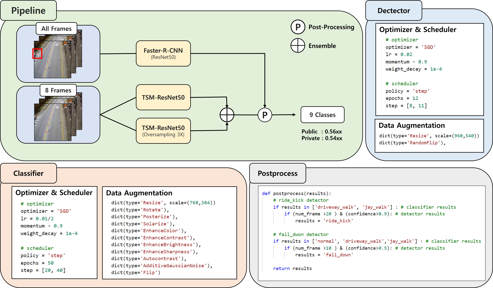
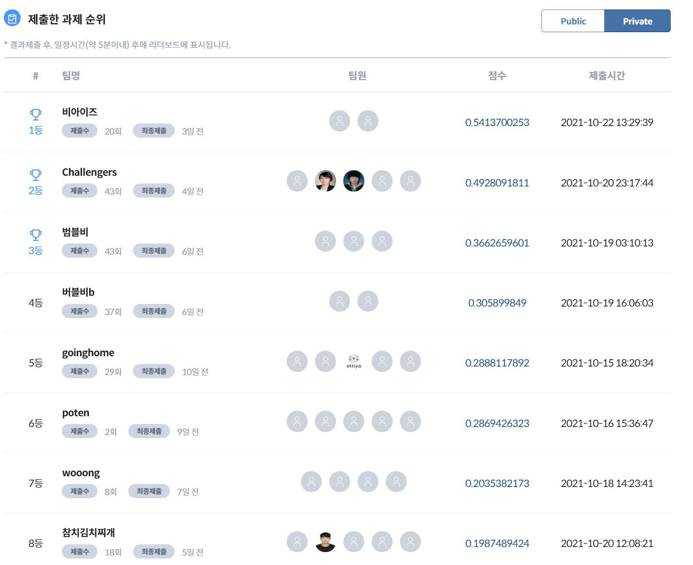

# Aiconnect_21_Action_Recognition
 
## Summary 


## Data Path 

```
​```
${Solution_Folder}
├── train.sh
├── inference.sh
├── preprocess.py
├── postprocess.py
├── extract.py
├── install.sh
├── mmaction2
|   ├── ...
|   |
├── mmdetection
|   ├── ...
├── data
|   ├── train.csv                         (original)
|   ├── sample_submission.csv             (original)
|   ├── train_list_rawframes_fold0.txt    (Preprocessed file for classifier training)
|   ├── train_list_rawframes_fold0_tw.txt (Preprocessed file for classifier training)
|   ├── val_list_rawframes_fold0.txt      (Preprocessed file for classifier validation)
|   ├── test_list_rawframes.txt           (Preprocessed file for classifier testing)
|   ├── train_detect_fold3.json           (Preprocessed file for detector training)
|   ├── val_detect_fold3.json             (Preprocessed file for detector validation)
|   ├── test.json                         (Preprocessed file for detector testing)
|   ├── results
|   |   ├── pretrained
|   |   |   ├── best_model.pth (model 1 / classifier)
|   |   |   ├── best_over_model.pth (model 2 / classifier)
|   |   |   ├── det.pth (model 3 / detector)
|   |   ├── results
|   |   |   ├── model1.pkl (model 1 output results/ classifier)
|   |   |   ├── model2.pkl (model 2 output results/ classifier)
|   |   |   ├── det_results.pkl (model 3 output results/ detector)
|   |   |   ├── leaderboard_final.csv (Our final leaderboard file)
|   |   |   ├── final.csv (Our reproduce file)
├── img
|   ├── summary.jpg
|   ├── leaderboard.JPG

​```
```

## Environments Settings
- #### CUDA version >= 11.1
- #### Pytorch version >= 1.8
- #### Ubuntu 18.04
- #### I trained the model using 4 Gpus (Rtx3090).

```

# create environment
$ conda create -n aiconnect python=3.9 -y
$ conda activate aiconnect

# install pytorch
$ conda install pytorch==1.8.0 torchvision==0.9.0 cudatoolkit=11.1 -c pytorch -c conda-forge

# install mmcv
$ pip install mmcv-full -f https://download.openmmlab.com/mmcv/dist/cu111/torch1.8.0/index.html

# install requirements
~/aiconnect_action$ bash install.sh
```

## Data Preparation
```
# mp4를 제 폴더에 옮길 필요없이 server에 있는 mp4 folder path만 지정해주시면 됩니다.

# Extract train video frames
~/aiconnect_action$ python extract.py --dir={competition_train_mp4_folder_dir_path} --output-root=./data/train_raw_frame

# Extract test video frames
~/aiconnect_action$ python extract.py --dir={competition_test_mp4_folder_dir_path} --output-root=./data/test_raw_frame

# Generate train files for mmaction & mmdetection
~/aiconnect_action$ python preprocess.py
```

## Inference & Post-processing & Generate final submission file
```
~/aiconnect_action$ bash inference.sh {number_of_gpu_to_use} # bash inference.sh 4
```

## Training Script
- I chose the best model1 & model2 & model3 models. 
```
# train model1(classifier) & model2(classifier) & model3(detector)
~/aiconnect_action$ bash train.sh {number_of_gpu_to_use} # bash inference.sh 4

# or
cd mmaction2

# train model1
~/aiconnect_action/mmaction2$ bash tools/dist_train.sh configs/recognition/tsm/super_tsm_r50_modify.py 4 --work-dir data/results/model1 --validate --seed 0 --deterministic

# train model2
~/aiconnect_action/mmaction2$ bash tools/dist_train.sh configs/recognition/tsm/super_tsm_r50_modify_oversampling.py 4 --work-dir data/results/model2 --validate --seed 0 --deterministic

cd ..
cd mmdetection
# train model3
~/aiconnect_action/mmdetection$ bash tools/dist_train.sh configs/faster_rcnn/faster_rcnn_r50_fpn_1x_coco.py 4 --work-dir data/results/model3 --seed 0 --deterministic
```


## Result


|      | **실험**                                                     |**Public**          |
| ---- | ------------------------------------------------------------ | -------------------|
| v1   | Baseline  (TSM-ResNet50)(Aug X)                              | 0.298              |
| v2   | + Heavy Aug                                                  | 0.413              |
| v3   | + Umbrella Processing                                        | 0.466              |
| v4   | + Oversampling ensemble                                      | 0.486              |
| v5   | + Naive Postprocessing                                       | 0.490              |
| v6   | + Detection Model                                            | **0.559**          |


## LeaderBoard 

